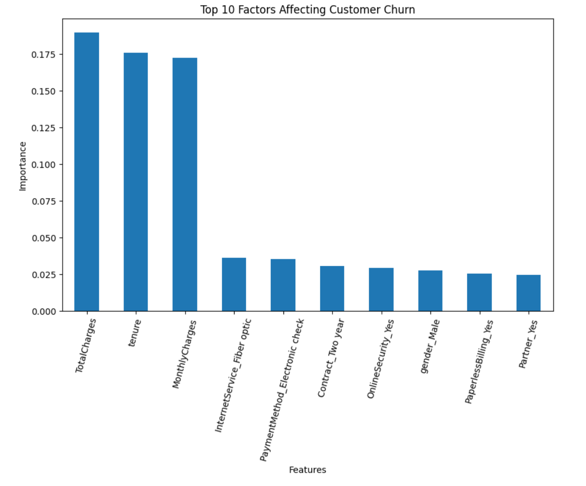

# Customer Churn Prediction & Retention Analytics using Python

## Project Overview
This project analyzes customer churn data and builds a machine learning model to predict whether a customer is likely to leave the company.

Customer churn is a critical business problem because retaining existing customers is often more cost-effective than acquiring new ones. The goal of this project is to identify churn drivers and generate insights that can support retention strategies.

## Tools Used
- Python
- Pandas
- Matplotlib
- Seaborn
- Scikit-learn
- Jupyter Notebook

## Dataset
The dataset contains customer demographic information, service usage details, billing information, account characteristics, and churn status.

## Project Workflow
1. Loaded and reviewed the customer churn dataset
2. Cleaned and prepared the data for analysis
3. Handled data type issues in `TotalCharges`
4. Performed exploratory data analysis to understand churn behavior
5. Encoded categorical variables for machine learning
6. Built a Random Forest model to predict churn
7. Evaluated model performance
8. Identified the most important churn drivers
9. Generated business insights and retention recommendations

## Model Performance
- Accuracy: 79%
- Churn Precision: 0.64
- Churn Recall: 0.46

## Key Insights
- TotalCharges, tenure, and MonthlyCharges were the most important predictors of churn
- Customers with shorter tenure were more likely to churn
- Customers with higher monthly charges showed higher churn risk
- Contract type and service-related features were strong churn drivers

## Feature Importance Preview

## Business Value
This analysis can help businesses:
- identify customers at risk of leaving
- understand key churn drivers
- prioritize customer retention efforts
- improve customer lifetime value

## Repository Structure
- `notebook/` → Jupyter Notebook analysis
- `data/` → dataset used in the project
- `report/` → written summary and business insights

## Files
- `customer_churn_analysis.ipynb` → full project notebook
- `customer_churn_analysis.html` → report 
- `customer_churn.csv` → dataset
- `insights_report.txt` → summary of findings

## Skills Demonstrated
- Data cleaning
- Exploratory data analysis
- Feature engineering
- Machine learning
- Model evaluation
- Business insight generation
